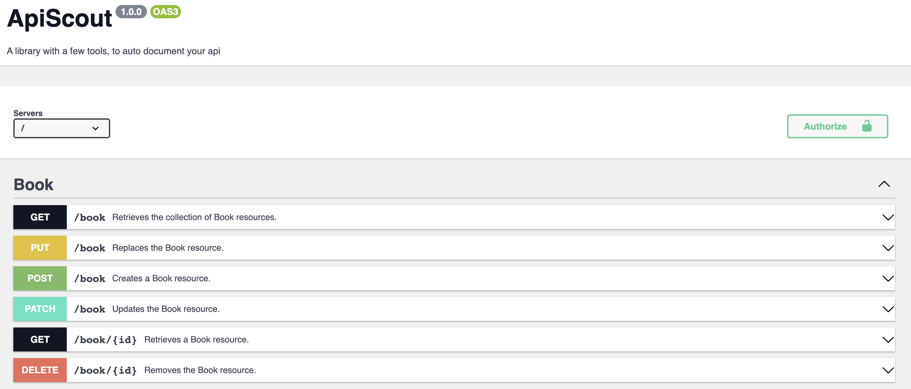
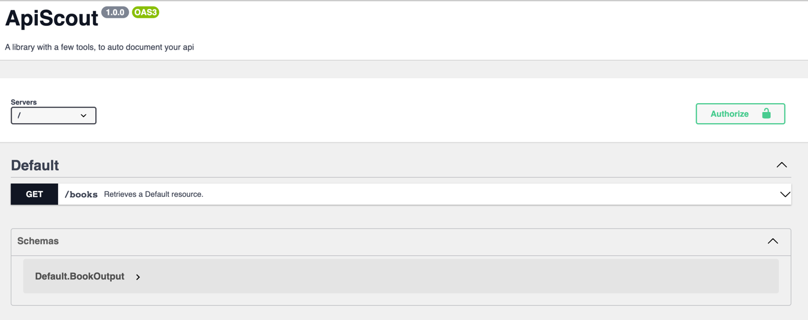

# ApiScout 🤠

## Introduction

This package uses the Symfony [serializer](https://symfony.com/doc/current/components/serializer.html)

- Enjoy the magic of an auto generated [Swagger](https://swagger.io) API Documentation
- [MapRequestPayload and MapQueryString](https://symfony.com/blog/new-in-symfony-6-3-mapping-request-data-to-typed-objects) to deserialize your Request
- Serialize automatically your Response by returning an object to the Controller 
- Nice Symfony [Validation](https://symfony.com/doc/current/validation.html) Response
- A [Pagination](docs/Attributes/GetCollection.md#working-with-pagination) tool to help you with your collections

<p align="center">
  
</p>

ApiScout will greatly help you develop your api without reinventing the wheel

You can choose to use those tools as well as not to use them without having to fight against ApiScout.

## Installation

```bash
composer require api-scout/api-scout dev-main
```

```php
<?php
# config/bundles.php

return [
    // ...
    ApiScout\Bridge\Symfony\Bundle\ApiScoutBundle::class => ['all' => true]
];
```

```yaml
# config/routes.yaml
api_scout_swagger_ui:
  path: /api/docs.{_format}
  controller: api_scout.swagger_ui.action
  methods: GET
  format: html
```

## Usage

Use one of the available attribute methods as follows
```php
<?php

namespace ApiScout\Controller;

use ApiScout\Attribute\Get;

final class GetBookController
{
    #[Get('/books')]
    public function __invoke(string $id): BookOutput
    {
        return new BookOutput(
            'PHPStan',
            'There is only one level with PHPStan. The level max.'
        );
    }
}
```
Your api specification is now available at: `/api/docs`




#### Methods
- [GetCollection](docs/Attributes/GetCollection.md)
- [Get](docs/Attributes/BasicOperations.md#get)
- [Post, Put, Patch](docs/Attributes/BasicOperations.md#post-put-patch)
- [Delete](docs/Attributes/BasicOperations.md#delete)

#### OpenApi
- [Configuration](docs/OpenApi/Configuration.md)
- [Specification Support](docs/OpenApi/SpecificationSupport.md)

#### Advanced
- [FileUpload](docs/FileUpload.md)
- [ErrorsHandling](docs/ErrorsHandling.md)
- [Configuration](docs/Configuration.md)

#### Migrate to Api-Scout

- [Migrate from ApiPlatform](docs/MigrateToApiScout/ApiPlatform.md)
- [Migrate from FosRestBundle](docs/MigrateToApiScout/FosRestBundle.md)

## Contributing

Pull requests are welcome. For major changes, please open an issue first to discuss what you would like to change.

Please make sure to update tests as appropriate.
For more information see the [contributing guide](CONTRIBUTING.md)

## Sponsor

<p align="center">
  
</p>

This library is sponsored by [Alximy](https://alximy.io)

>A team of passionate humans from very different backgrounds, sharing our love of PHP, Symfony and its ecosystem. Our CTO, Expert developers, tech leads, can help you learn or develop the tools you need, and perform audits or tailored workshops. We value contributing to the Open Source community and are willing to mentor new contributors in our team or yours.
